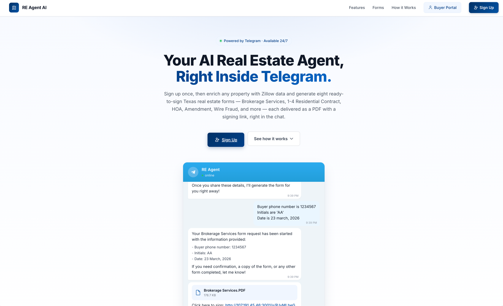
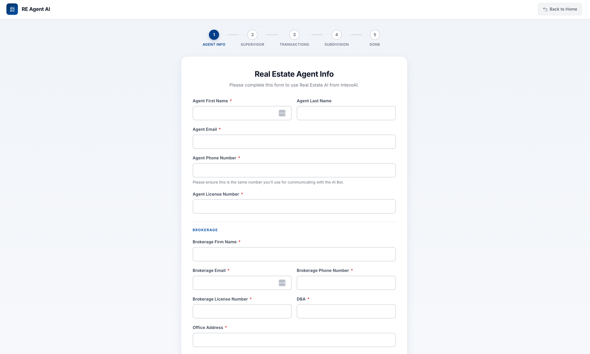

# RE Agent AI — Buyer Portal & Agent Signup

Flask web app that serves two surfaces for the **RE Agent AI** product (IntevoAI):

1. **Buyer portal** — buyers look up the offers and documents their agent has prepared for them, keyed on their phone number.
2. **Agent signup wizard** — a 5-step onboarding form that registers a real estate agent, captures their brokerage / supervisor / transaction defaults, and hands them off to the Telegram bot (`@reagent512_bot`) that actually generates Texas real estate forms (Brokerage Services, 1-4 Residential Contract, HOA, Amendment, Wire Fraud, etc.) from Zillow data.

The backend of record is **Baserow** at `baserow.intevoai.com` — buyers live in table `684`, agents in table `687`.



---

## How it fits together

```
Landing page  ─►  /signup (5-step wizard) ─► Baserow table 687 ─► Telegram bot deep-link
                                                                   (?start=<6-digit token>)

Landing page  ─►  /login (phone lookup) ───► Baserow table 684 ─► /dashboard/<phone>
                                                                   (list of offer PDFs + sign links)
```

The portal itself does not generate forms or talk to Zillow. Form generation, Zillow enrichment, and PDF delivery happen inside the Telegram bot (separate n8n / agent workflow). The portal's job is signup, lookup, and presentation.

---

## Stack

- **Python 3.12** + **Flask 3.1**
- **Jinja2** templates (server-rendered, no JS framework)
- **requests** for Baserow REST calls
- **gunicorn** in production
- **Docker** (slim base) for deployment

No database of its own. No auth library — buyer "login" is phone-number lookup against Baserow, agent signup is session-backed multi-step form. Treat both as low-trust by default.

---

## Routes

| Route | Method | Purpose |
|-------|--------|---------|
| `/` | GET | Landing page |
| `/login` | GET, POST | Buyer phone lookup |
| `/dashboard/<phone>` | GET | List of offers / PDFs for that buyer |
| `/signup` | GET | Reset wizard state, redirect to step 1 |
| `/signup/agent` | GET, POST | Step 1 — agent + brokerage info |
| `/signup/supervisor` | GET, POST | Step 2 — designated supervisor |
| `/signup/transactions` | GET, POST | Step 3 — transaction defaults (option fee, periods, title, warranty) |
| `/signup/subdivision` | GET, POST | Step 4 — HOA / subdivision rules. Submits to Baserow, generates token. |
| `/signup/done` | GET | Step 5 — shows the Telegram deep-link the agent uses to bind their account |



Step 4 is where the Baserow `POST` happens. On success it generates:

- a `User ID` (`uuid4`)
- a 6-digit `signup_token` (`secrets.randbelow`)

and redirects to `https://t.me/reagent512_bot?start=<token>`. The Telegram bot reads `<token>` from the `/start` payload to bind the Telegram chat to the agent row in Baserow.

---

## Configuration

All secrets and table URLs come from environment variables. `app.py` loads them at import time via `python-dotenv` (so a local `.env` works) and falls back to hard failure if any required value is missing.

| Variable | Required | Default | Notes |
|----------|----------|---------|-------|
| `FLASK_SECRET_KEY` | yes | — | Generate with `python -c "import secrets; print(secrets.token_hex(32))"` |
| `BASEROW_TOKEN` | yes | — | Baserow API token. Rotate via `baserow.intevoai.com → Settings → API tokens`. |
| `BASEROW_BUYER_TABLE_URL` | no | `https://baserow.intevoai.com/api/database/rows/table/684/` | Override only if the table moves. |
| `BASEROW_AGENT_TABLE_URL` | no | `https://baserow.intevoai.com/api/database/rows/table/687/` | Same. |
| `TELEGRAM_BOT_USERNAME` | no | `reagent512_bot` | Used to build the `https://t.me/<bot>?start=<token>` deep link at the end of signup. No `@` prefix. |

Copy the template and fill it in:

```bash
cp .env.example .env
# edit .env, then:
```

`.env` is gitignored; `.dockerignore` also excludes it from the image, so secrets must be supplied at container runtime.

---

## Running locally

```bash
python3 -m venv venv
source venv/bin/activate
pip install -r requirements.txt
cp .env.example .env       # then fill in FLASK_SECRET_KEY + BASEROW_TOKEN
python app.py              # dev server on :5000
```

Or with Docker (pass env vars at runtime, do not bake them in):

```bash
docker build -t re-agent-portal .
docker run --rm -p 5000:5000 --env-file .env re-agent-portal
```

Gunicorn binds to `$PORT` (default `5000`) inside the container.

---

## Baserow schema (table 687 — agents)

The signup wizard writes to Baserow using **field IDs** (not field names), so the table's columns can be renamed in the UI without breaking the POST. The mapping lives in `create_agent_row()` in `app.py`. Key fields:

| Field ID | Meaning |
|----------|---------|
| `field_6686` / `field_6774` | Agent first name / full name |
| `field_6775` / `field_6776` | Agent email / phone |
| `field_6785` | Agent license number |
| `field_6768` / `field_6769` | Brokerage firm / license |
| `field_6771`–`field_6773`, `field_6786` | Supervisor name, email, phone, license |
| `field_6779` / `field_6780` / `field_6782` | Option period, survey, objection (days) |
| `field_6781` / `field_6783` | Title policy payer, home warranty preference |
| `field_7611`–`field_7617` | Subdivision / HOA rules, escrow agent |
| `field_7608` / `field_6690` | Broker fee, default option fee |
| `field_6800` / `field_7620` | User ID (uuid), signup token |

Renaming a column in Baserow is safe. **Deleting or recreating a column changes the ID** and will break this POST — keep field IDs stable on the Baserow side.

Table 684 (buyers) is read-only from this app — phone-number filter via `?filter__Buyer Phone__equal=...`.

---

## Project layout

```
.
├── app.py                  # All routes + Baserow POST
├── baserow.py              # Standalone smoke-test for the buyer lookup
├── test.py / test.html     # Throwaway test fixtures
├── requirements.txt
├── Dockerfile
├── static/
│   ├── styles.css
│   └── home-button.png
└── templates/
    ├── landing.html
    ├── login.html
    ├── dashboard.html
    └── signup/
        ├── agent.html
        ├── supervisor.html
        ├── transactions.html
        ├── subdivision.html
        └── done.html
```

`signup_layout.html` is the shared wizard chrome (progress bar, "Back to Home" button).

---

## Known gaps

- **Rotate the leaked Baserow token.** The original commit history of this repo contains a hardcoded token (`app.py` before the env-var refactor). Treat it as compromised — regenerate it in Baserow before deploying anywhere internet-facing.
- **No CSRF** on the wizard forms — fine while behind auth-restricted access, not fine on the public internet.
- **No rate limiting** on `/login` — buyer phone numbers are guessable, and the dashboard exposes offer PDFs by phone alone. Add per-IP throttling + a second factor (e.g., OTP) before treating this as production-grade.
- **Flask dev server in `__main__`** — production uses gunicorn via the Dockerfile, but `python app.py` will boot debug mode. Don't expose that publicly.
- **`test.py` / `test.html`** are scratch files; delete or move to `scripts/` once the wizard stabilizes.

---

## Related

- Telegram bot: [`@reagent512_bot`](https://t.me/reagent512_bot)
- Baserow workspace: `baserow.intevoai.com`
- Parent product: RE Agent AI (IntevoAI)
